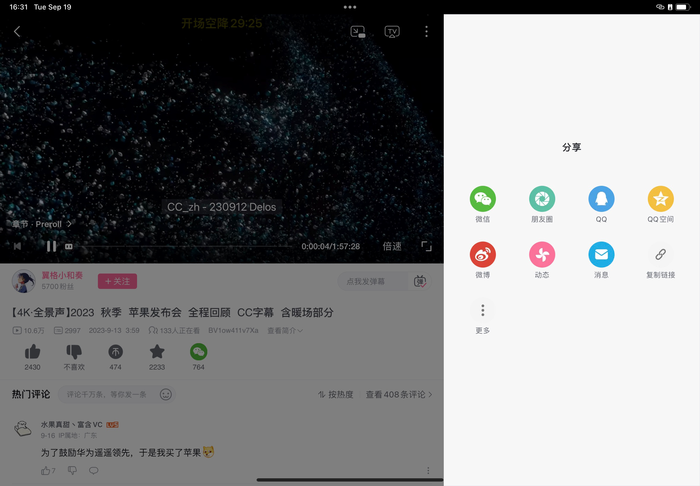

# Importing Videos from Bilibili

To import videos from Bilibili into ClipMemo, you'll first need to obtain the Bilibili video link. Here's how you can get that link from different clients.

## Importing from Mobile App

Open the video you want to add to ClipMemo, tap on the share icon below the video, and choose "Copy Link" to get the link. Alternatively, tap on "More" and look for ClipMemo in the pop-up menu. A simple tap on the icon will open ClipMemo and automatically import the video.

If you don't have the Bilibili app installed on your device, you can also share the video directly from the browser to ClipMemo. Open the video page in Safari, tap the "Share" button, and select the ClipMemo icon to import it into ClipMemo.

## Importing from Web Version

In a web browser, the URL in the address bar is the video link. Simply click on the address bar to select the entire link, and then copy it.
