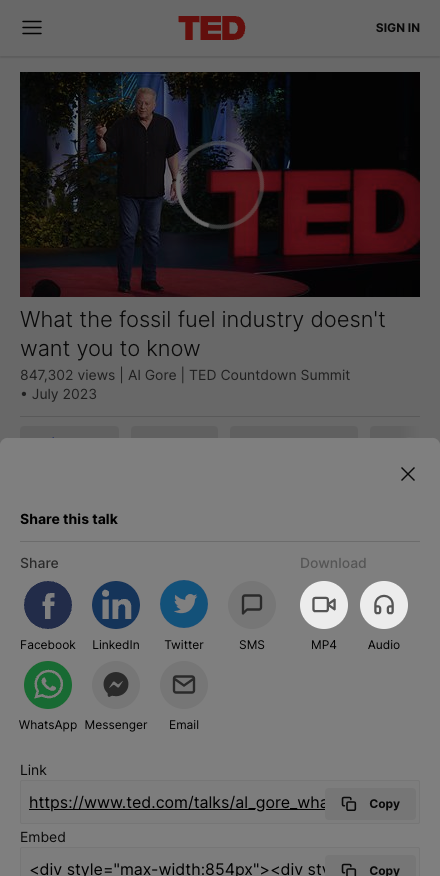

# Import from TED

:::tip Do you know?

Most TED videos are also avalible on YouTube.

:::

1. Go to the TED website, and find the video you want to talk. For example, [this one](https://www.ted.com/talks/ken_robinson_says_schools_kill_creativity?language=en).

2. Click the "Share" button.

    

3. Click the "Download" button.

    
