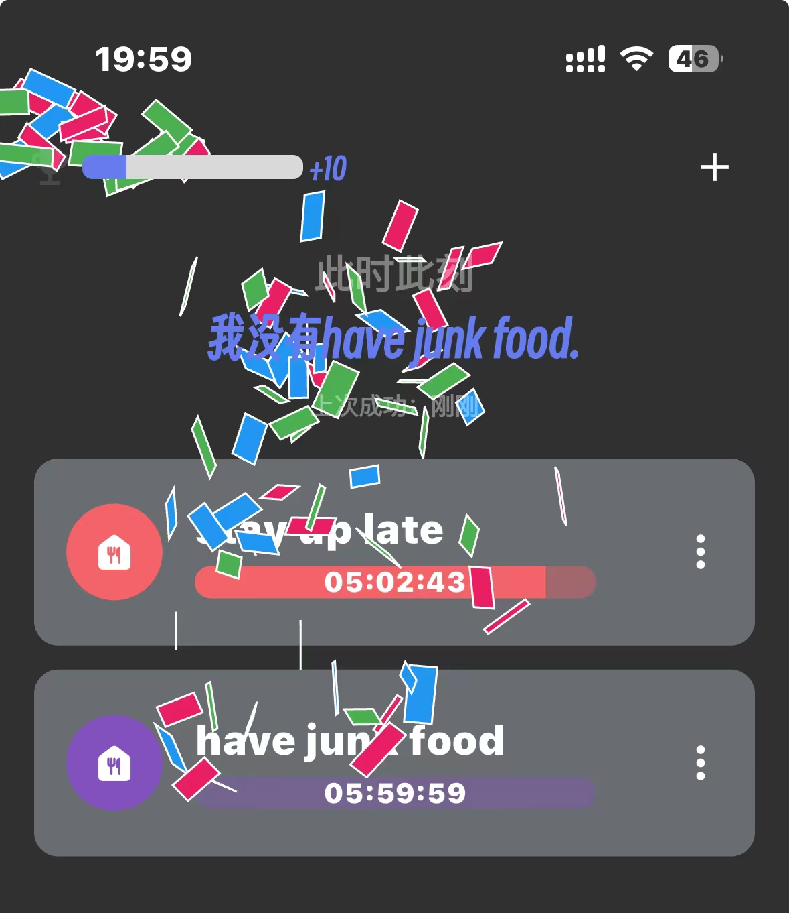
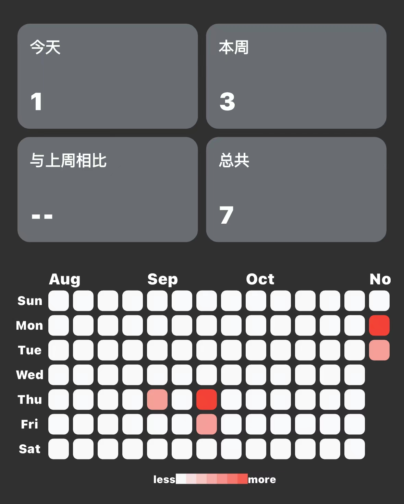
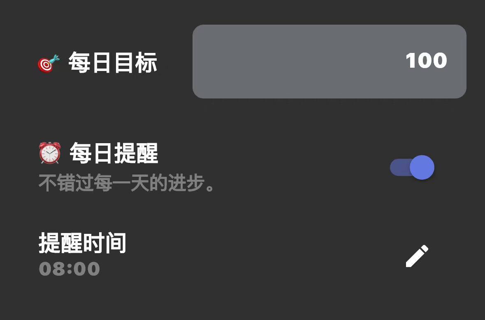

# I Didn't

Welcome to I Didn't. You can leave the bad habits you want to quit in it and clock in on time. Our app will remind and encourage your progress at appropriate times, trying our best to help you quit bad habits.

We hope this app can really help you and make you a better person in your mind.

## Why Didn't

Do you feel guilty because you stay up late often?

Do you keep saying you want to quit smoking but can't?

Have you spent the afternoon watching short videos and found that you haven't started the work you planned in advance?

With the increasing stress of modern life, people will need some ways to release stress. Some stress release methods are healthy and acceptable, but some are unhealthy bad habits. These habits may have negative effects on their health, finances, relationships, etc.

However, many people find it difficult to overcome these habits by their own strength. Therefore, an app that can help them quit bad habits is in great demand.

## Our Goal

-   Record the bad habits you find
-   Urge you to control the frequency of doing something
-   Remind and encourage at appropriate times
-   Record your journey of quitting bad habits
-   Make you a better person

## Our Non-goal

-   Self-deception: It only takes a few clicks to clock in, but whether you really stay away from these bad habits during this period depends on your actual actions.
-   Prevent reinfection: Maybe you successfully use this app to stay away from some bad habits with your own efforts for a period of time. But you need to note that you also need to supervise yourself not to fall into these bad habits again, because we can't supervise you forever.

## Featured display

#### Exquisite animation

#### Clear process records at a glance

#### Goal setting and reminder mechanism

## Community and Support

If you encounter any issues, you can reach out to us or seek help from the community.

-   Reddit: [https://www.reddit.com/r/ClipMemo/](https://www.reddit.com/r/ididnt/)
-   Discord: [https://discord.gg/4nGcs632](https://discord.gg/4nGcs632)
-   QQ: 923724755
